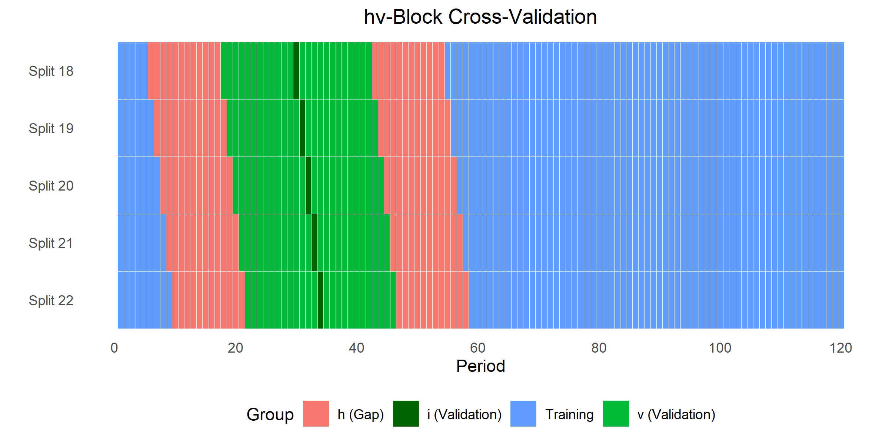
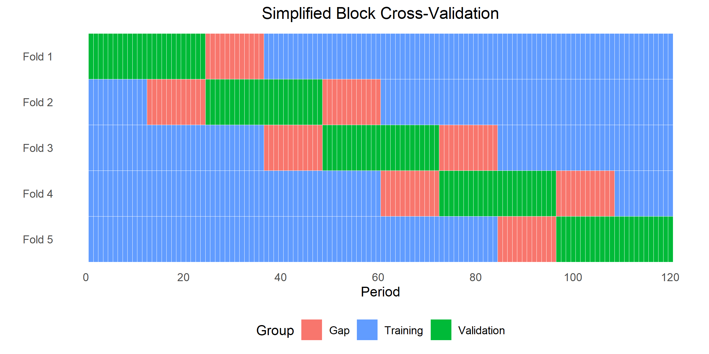

# Simplified block cross-validation for time series in R

## Introduction
This repository introduces a simple cross-validation scheme for time series data in `R` which I developed as part of a term project in a class on Computational Statistics. The procedure extends the `createTimeSlices` function from the `caret` package (Kuhn et al., 2008), which allows to manually supply indices for the construction of the cross-validation samples.

Almost all machine learning methods rely on the analysis of an out-of-sample testing error to select the appropriate level of flexibility (“tuning”). For example, to choose the penalty parameter of LASSO or to select the depth of a tree, one usually assesses the prediction error on an independent test set. To avoid losing too much data from using a separate training and testing sample, the method most commonly used to perform such tests is cross-validation (CV). CV proceeds by randomly splitting the sample into a number of *k* subsets (folds) of approximately equal size. Then each of the subsets is used as a test set for a model that is trained on the remaining *k-1* folds. The overall prediction error is obtained by averaging over the errors in each of the *k* folds. In the most extreme case, *k* is set to the sample size such that every single observation is used once as a validation set. This is referred to as Leave-One-Out Cross-Validation (LOOCV). It can be shown that it is approximately unbiased for the true prediction error, since there is only a minimal loss from using *N -1* instead of *N* observations in the respective training sets.

However, the nice theoretical properties of cross-validation only hold in samples with independent and identically distributed observations. This is likely not satisfied when using time series data, even if the sample is stationary. Since stationarity requires that any two sub-series of equal length have the same joint distribution, it seems appropriate to assume that stationary time series are identically distributed (Bergmeir and Benítez, 2012). However, due to their time series nature, observations likely depend on each other over time even after taking first differences. Hence, we must resort to alternative validation methods for dependent data.

A broad range of different approaches to deal with cross-validation in time-series settings has been proposed in the literature. The simplest approach is to split the data into only one test set (usually a block at the end of the time horizon) and one training set (the remaining data). Then one can train different machine learners on the training data and compare their predictive performance on the test data. However, for model tuning of the individual learners, one needs further splits of the training data. To exploit the full information available in the training set, several time series cross-validation strategies have been proposed:

The `createTimeSlices` function from the `caret` package implements a forward rolling window. After defining an initial window of training observations at the beginning of the time period and a prediction horizon to test on, the function iterates over the training observations, shifting the training window and testing period over time. While respecting the time dimension of the data, this approach has two main disadvantages. First, it does not account for the fact that observations in the training and test samples might not be independent. Second, it uses only training observations before the testing period which might be restrictive in small samples. 

One approach that has been argued to be asymptotically consistent with dependent data is the *hv*-block cross-validation proposed by Racine (2000). For a given observation *i*, this method takes an additional *v* observations from either side of *i* to form a validation set of size *n_v=1+2v*. Next, another *h* units from either side of the validation set are deleted such that *n_t = n-1-2v-2h* observations are used for the training set. This procedure is repeated for all observations *i*, leading to *n-2v* validation and training sets. The intuition for deleting *h* observations directly follows from the idea that autocorrelation in stationary time series depends only on the lag between the observations and decreases with increasing distance. Hence, it is assumed that by dropping a sufficient number of observations around the validation sample, independence between the training and validation samples can be established. The following figure illustrates five consecutive partitions of the approach for a sample of 120 time periods hand *h=v=* 12 (96 splits in total).



Since *hv*-block CV iterates over all observations in the sample, it is computationally expensive. Hence, I also implemented a less costly strategy that combines *k*-fold CV and *hv*-block CV as suggested by Bergmeir and Benítez (2012). In particular, they adjust the usual *k*-fold CV in two ways: Firstly, the observations are not reshuffled before splitting the data into *k* folds such that the time order is not distorted. Secondly, a number of *h* observations are deleted before and after the validation set as in the *hv*-block CV. The approach is illustrated in the following Figure for an exemplary sample of 120 months with *k*=5 and a gap of 12 time periods before and after the validation sample.



## Example

This code snippet shows how to implement the cross-validation schemes using `caret`. The functions can be directly loaded into `R` using `source_url()` from the `devtools` package. In the examples I use cross-validation for parameter tuning only. However, the functions could generally also be used to test out-of sample predictive performance. 

```r
# Load packages
require(caret)
require(ggplot2)
require(devtools)

# Load data from ggplot package
data("economics")

# Load functions from github
source_url("https://raw.githubusercontent.com/fmuny/timeseries_cv/master/code/cv_functions.R")

# Compute first differences and plot
df_ts <- diff(ts(economics[,2:6], start = c(1967, 7), frequency = 12))
plot(df_ts)

# Split in training and test set
df_train <- window(df_ts, start = c(1990, 1), end = c(2000, 12))
df_test  <- window(df_ts, start = c(2001, 1), end = c(2005, 12))

# 1.) How to use Timeslice
# Prepare indices
fitControl <- trainControl('timeslice', initialWindow = 12, horizon = 12)
# Run ML model
set.seed(156)
model_ts <- train(pce ~., data = df_train, method = "rf", trControl = fitControl)
# Predict on test set
pred_ts <- predict(model_ts, newdata = df_test[,-1])
# Compute performance measures 
perf_ts <- postResample(pred = pred_ts, obs = df_test[,1])

# 2.) How to use hv-block cross-validation
# Prepare indices
hv <- hv_block(df_train, v_before=12, v_after=12, gap_before=12, gap_after=12)
fitControl <- trainControl("cv", index = hv[['training']], 
                           indexOut = hv[['validation']])
# Run ML model
set.seed(156)
model_hv <- train(pce ~., data = df_train, method = "rf", trControl = fitControl)
# Predict on test set
pred_hv <- predict(model_hv, newdata = df_test[,-1])
# Compute performance measures 
perf_hv <- postResample(pred = pred_hv, obs = df_test[,1])

# 3.) How to use simplified block cross-validation
# Prepare indices
simp <- simplified_block(df_train, n_splits=5, gap_before=12, gap_after=12)
fitControl <- trainControl("cv", index = simp[['training']], 
                           indexOut = simp[['validation']])
# Run ML model
set.seed(156)
model_si <- train(pce ~., data = df_train, method = "rf", trControl = fitControl)
# Predict on test set
pred_si <- predict(model_si, newdata = df_test[,-1])
# Compute performance measures 
perf_si <- postResample(pred = pred_si, obs = df_test[,1])['RMSE']

# 4.) Compare results
data.frame(In_sample_RMSE = c(round(min(model_ts$results$RMSE),3),
                              round(min(model_hv$results$RMSE),3),
                              round(min(model_si$results$RMSE),3)),
           Out_of_sample_RMSE = c(round(perf_ts['RMSE'],3),
                                  round(perf_hv['RMSE'],3),
                                  round(perf_si['RMSE'],3)),
           row.names = c('Timeslice','hv-block', 'Simplified block'))
```

## References 

* Bergmeir, C., & Benítez, J. M. (2012). On the use of cross-validation for time series predictor evaluation. Information Sciences, 191, 192-213.
* Kuhn, M. (2008). Building predictive models in R using the caret package. Journal of statistical software, 28(1), 1-26.
* Racine, J. (2000). Consistent cross-validatory model-selection for dependent data: hv-block cross-validation. Journal of econometrics, 99(1), 39-61.
